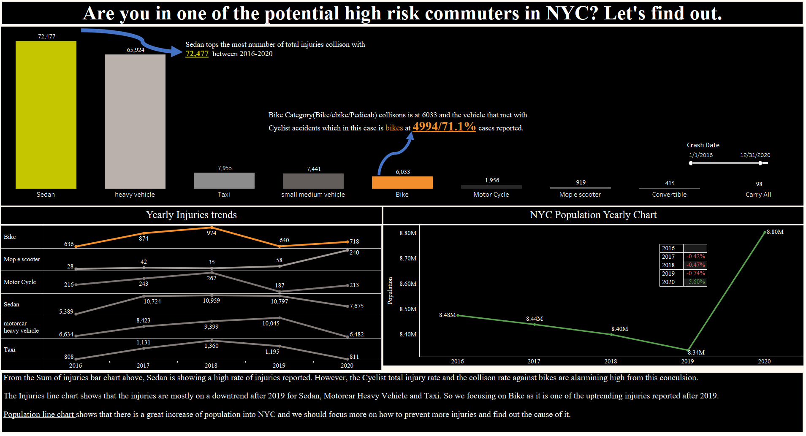
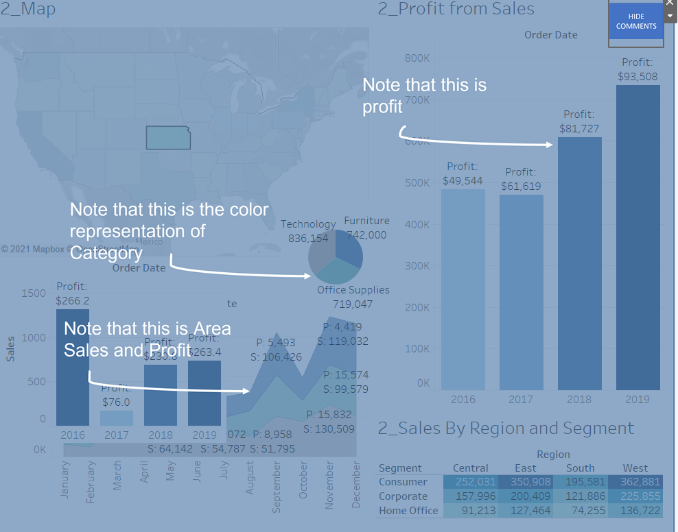
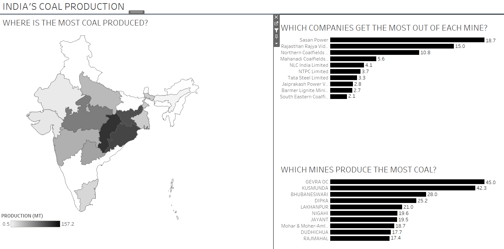
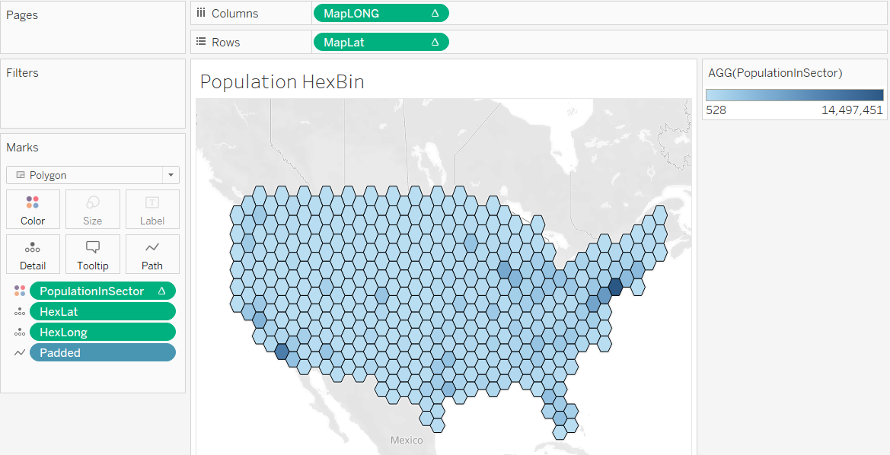

# Welcome to the tableau projects completed by Leroy Yeo
portfolio of tableau projects

## Project 1 - NYC motor vehicle accident and collisons
Ongoing project with the objective of focusing the factors, areas, time, and rate of collison against other vehicles to lower risk of Cyclist injury and Fatalities.

## Project 2 - Dashboard with Overlay comments
This is to show that we can also implement comments while with a click of a button to switch into another background.

## Project 3 - Dashboard India Coal mining
An intuitive dashboard which shows the different coal minings in India.  

## Project 4 - Hexbining with Map 
High level deploying Hex charts onto maps. 

## Technologies
* Tableau
